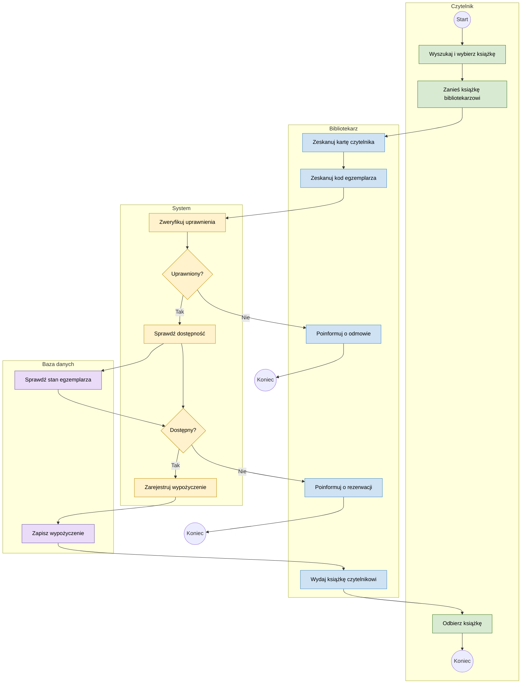

# Diagram wypożyczania książki w bibliotece

```mermaid
flowchart TB

    subgraph C["Czytelnik"]
        direction TB
        A((Start))
        B["Wyszukaj i wybierz książkę"]
        C1["Zanieś książkę bibliotekarzowi"]
        D["Odbierz książkę"]
        E((Koniec))
        A --> B --> C1
        D --> E
    end

    subgraph L["Bibliotekarz"]
        direction TB
        F["Zeskanuj kartę czytelnika"]
        G["Zeskanuj kod egzemplarza"]
        H["Poinformuj o odmowie"]
        I["Poinformuj o rezerwacji"]
        J["Wydaj książkę czytelnikowi"]
        F --> G
    end

    subgraph S["System"]
        direction TB
        K["Zweryfikuj uprawnienia"]
        Q{"Uprawniony?"}
        M["Sprawdź dostępność"]
        N{"Dostępny?"}
        O["Zarejestruj wypożyczenie"]
        K --> Q
        Q -- Tak --> M
        M --> N
        N -- Tak --> O
    end

    subgraph DB["Baza danych"]
        direction TB
        R["Sprawdź stan egzemplarza"]
        T["Zapisz wypożyczenie"]
    end

    C1 --> F
    G --> K
    Q -- Nie --> H
    H --> Z1((Koniec))
    M --> R
    R --> N
    N -- Nie --> I
    I --> Z2((Koniec))
    O --> T
    T --> J
    J --> D

    classDef reader fill:#d9ead3,stroke:#38761d,color:#000
    classDef staff fill:#cfe2f3,stroke:#3d85c6,color:#000
    classDef system fill:#fff2cc,stroke:#bf9000,color:#000
    classDef database fill:#eadcf8,stroke:#674ea7,color:#000

    class B,C1,D reader
    class F,G,H,I,J staff
    class K,Q,M,N,O system
    class R,T database
```
